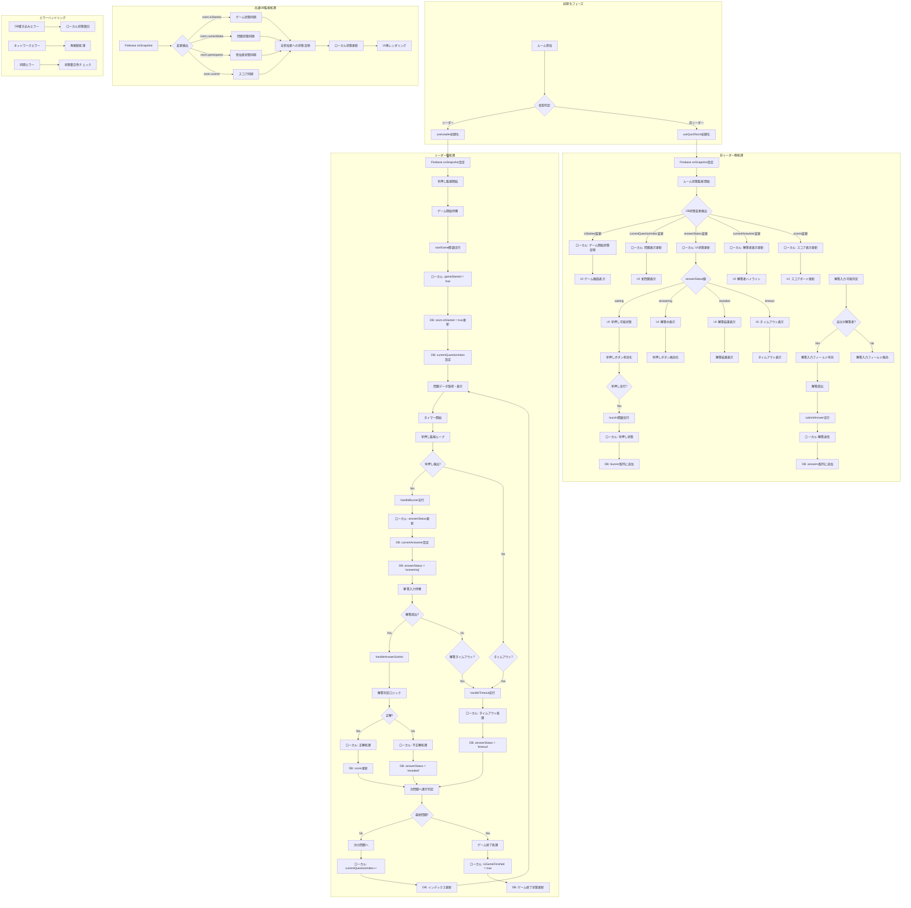
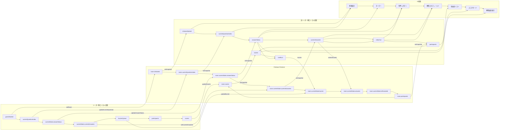
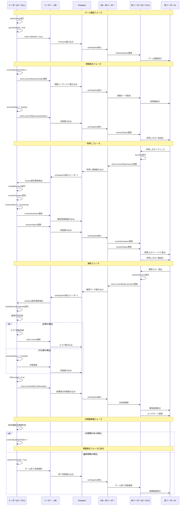
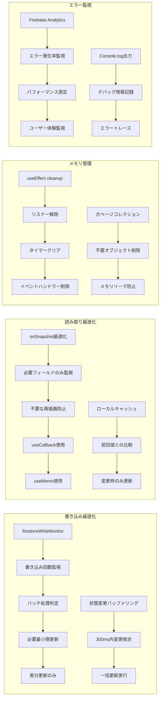

# クイズシステム処理フロー詳細図

## 概要
リーダー/非リーダー × ローカル/DBの4つの要素における処理フローを詳細に図式化

## メイン処理フロー



## 詳細状態遷移図

```mermaid
stateDiagram-v2
    [*] --> Initializing : ルーム参加
    
    state "初期化" as Initializing {
        [*] --> RoleCheck : 役割確認
        RoleCheck --> LeaderInit : リーダー
        RoleCheck --> ParticipantInit : 非リーダー
        
        LeaderInit --> [*] : useLeader初期化完了
        ParticipantInit --> [*] : useQuizRoom初期化完了
    }
    
    Initializing --> Waiting : 初期化完了
    
    state "待機状態" as Waiting {
        [*] --> GameWaiting : ゲーム開始待機
        GameWaiting --> GameWaiting : 参加者状態更新
    }
    
    Waiting --> Playing : ゲーム開始
    
    state "プレイ中" as Playing {
        [*] --> QuestionDisplay : 問題表示
        
        state "問題表示" as QuestionDisplay {
            [*] --> TimerStart : タイマー開始
            TimerStart --> BuzzerWaiting : 早押し待機
            
            state "早押し待機" as BuzzerWaiting {
                [*] --> Monitoring : 監視開始
                Monitoring --> BuzzerPressed : 早押し検出
                Monitoring --> QuestionTimeout : 時間切れ
            }
        }
        
        QuestionDisplay --> Answering : 早押し成功
        
        state "解答中" as Answering {
            [*] --> InputWaiting : 入力待機
            InputWaiting --> AnswerSubmitted : 解答提出
            InputWaiting --> AnswerTimeout : 解答時間切れ
            
            state "解答判定" as Judging {
                AnswerSubmitted --> Correct : 正解判定
                AnswerSubmitted --> Incorrect : 不正解判定
                AnswerTimeout --> Timeout : タイムアウト
            }
        }
        
        Answering --> Judging : 解答処理
        QuestionDisplay --> Judging : 問題タイムアウト
        
        state "結果表示" as Judging {
            Correct --> ScoreUpdate : スコア更新
            Incorrect --> NextCheck : 次問題チェック
            Timeout --> NextCheck : 次問題チェック
            
            ScoreUpdate --> NextCheck : 更新完了
            
            NextCheck --> NextQuestion : 次問題あり
            NextCheck --> GameEnd : 最終問題
        }
        
        Judging --> QuestionDisplay : 次問題
        Judging --> [*] : ゲーム終了
    }
    
    Playing --> Finished : 全問題完了
    
    state "終了" as Finished {
        [*] --> ResultDisplay : 結果表示
        ResultDisplay --> Cleanup : クリーンアップ
        Cleanup --> [*]
    }
    
    Finished --> [*] : ルーム退出
```

## データフロー詳細図



## 処理タイミング詳細図



## エラーハンドリング・同期制御詳細図

```mermaid
graph TB
    subgraph "同期エラー処理"
        SE1[DB書き込み失敗] --> SE2{エラー種別判定}
        SE2 -->|ネットワークエラー| SE3[再試行処理]
        SE2 -->|権限エラー| SE4[権限確認]
        SE2 -->|データ競合| SE5[競合解決]
        
        SE3 --> SE6[指数バックオフ再試行]
        SE4 --> SE7[認証状態確認]
        SE5 --> SE8[最新状態取得]
        
        SE6 --> SE9{再試行成功?}
        SE7 --> SE10{認証OK?}
        SE8 --> SE11[ローカル状態修正]
        
        SE9 -->|Yes| SE12[正常状態復旧]
        SE9 -->|No| SE13[ユーザー通知]
        SE10 -->|Yes| SE14[処理継続]
        SE10 -->|No| SE15[再認証要求]
        SE11 --> SE12
    end
    
    subgraph "状態整合性チェック"
        SC1[定期整合性チェック] --> SC2[ローカルとDB比較]
        SC2 --> SC3{整合性OK?}
        SC3 -->|No| SC4[不整合検出]
        SC3 -->|Yes| SC5[チェック継続]
        
        SC4 --> SC6[優先度判定]
        SC6 -->|DB優先| SC7[ローカル状態上書き]
        SC6 -->|ローカル優先| SC8[DB状態上書き]
        SC6 -->|マージ必要| SC9[状態マージ処理]
        
        SC7 --> SC10[UI再描画]
        SC8 --> SC11[DB書き込み]
        SC9 --> SC12[マージ結果適用]
    end
    
    subgraph "リアルタイム監視異常"
        RT1[onSnapshot切断] --> RT2[切断検出]
        RT2 --> RT3[再接続試行]
        RT3 --> RT4{再接続成功?}
        RT4 -->|Yes| RT5[監視再開]
        RT4 -->|No| RT6[ポーリング切替]
        
        RT5 --> RT7[状態同期確認]
        RT6 --> RT8[定期的状態取得]
        RT7 --> RT9[差分適用]
        RT8 --> RT10[手動同期処理]
    end
    
    subgraph "競合状態処理"
        CO1[同時早押し検出] --> CO2[タイムスタンプ比較]
        CO2 --> CO3[最早押し判定]
        CO3 --> CO4[重複解答者削除]
        CO4 --> CO5[正式解答者確定]
        
        CO6[同時解答提出] --> CO7[解答順序確認]
        CO7 --> CO8[最初の解答採用]
        CO8 --> CO9[後続解答無効化]
        
        CO10[状態更新競合] --> CO11[楽観的ロック確認]
        CO11 --> CO12[バージョン確認]
        CO12 --> CO13{バージョンOK?}
        CO13 -->|Yes| CO14[更新実行]
        CO13 -->|No| CO15[最新取得後再試行]
    end
```



## 性能最適化・監視詳細図


